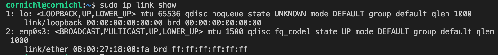
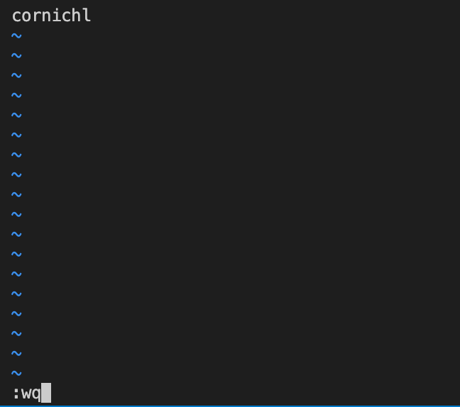
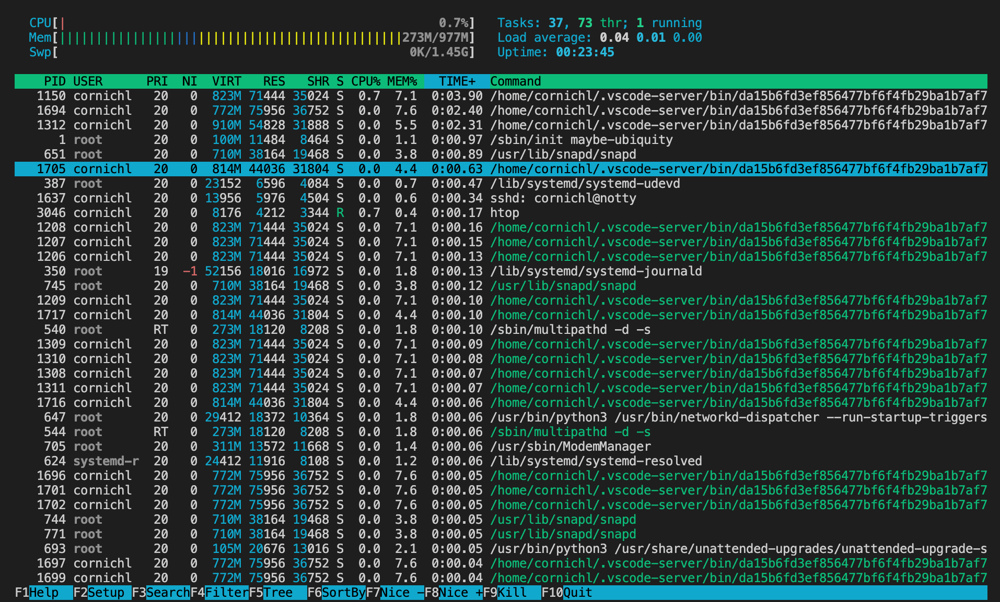

# Linux

# Part 1. Установка ОС
## Установить Ubuntu 20.04 Server LTS без графического интерфейса.

# Part 2. Создание пользователя
## Создать пользователя, отличного от пользователя, который создавался при установке. Пользователь должен быть добавлен в группу adm.

1. Создание нового пользователя с заданными именем и паролем:

`sudo adduser test_user`

2. Добавление пользователя в группу adm:

`sudo usermod -aG adm test_user`

# Part 3. Настройка сети ОС
## Задать название машины вида user-1

`sudo hostnamectl set-hostname user-1`

## Установить временную зону, соответствующую вашему текущему местоположению.

`sudo timedatectl set-timezone "$(curl -s https://ipapi.co/timezone)"`
- Эта команда устанавливает временную зону в соответствии с текущим местоположением, определенным по IP-адресу.

## Вывести названия сетевых интерфейсов с помощью консольной команды.

`sudo ip link show`
- Показывает все сетевые интерфейсы, включая те, которые не активированы в данный момент.

### В отчёте дать объяснение наличию интерфейса lo

**lo (loopback device)** – виртуальный интерфейс, присутствующий по умолчанию в любом Linux. Он используется для отладки сетевых программ и запуска серверных приложений на локальной машине. С этим интерфейсом всегда связан адрес 127.0.0.1.

## Используя консольную команду получить ip адрес устройства, на котором вы работаете, от DHCP сервера.

`ifconfig` или

`ip addr show` или

`wget -O - -q icanhazip.com`
- Эта команда выполняет запрос к внешнему серверу icanhazip.com через утилиту wget. Флаг "-O" указывает на имя файла, в который будет записан результат запроса (в данном случае - "-", что означает, что результат будет выведен в стандартный вывод). Флаг "-q" указывает на тихий режим работы, без отображения информации о прогрессе. В результате команда выведет на экран IP-адрес компьютера.
- icanhazip.com - это бесплатный сервис, который позволяет узнать IP-адрес вашего компьютера или сервера. Для этого достаточно отправить GET-запрос по адресу icanhazip.com, и сервер ответит вам вашим текущим IP-адресом.

### В отчёте дать расшифровку DHCP.

**DHCP (англ. Dynamic Host Configuration Protocol)** — протокол динамической настройки узла) — прикладной протокол, позволяющий сетевым устройствам автоматически получать IP-адрес и другие параметры, необходимые для работы в сети TCP/IP. Данный протокол работает по модели «клиент-сервер».

## Определить и вывести на экран внешний ip-адрес шлюза (ip) и внутренний IP-адрес шлюза, он же ip-адрес по умолчанию (gw).

Для того чтобы определить внешний IP-адрес шлюза, можно использовать утилиту curl и обратиться к одному из сайтов, которые отображают эту информацию.

`curl ifconfig.me`

Для вывода внутреннего IP-адреса шлюза (он же IP-адрес по умолчанию) можно воспользоваться командой ip route show, которая отобразит таблицу маршрутизации.

`ip route show | grep 'default via' | awk '{print $3}'`

- ip route show - команда для вывода информации о таблице маршрутизации
- grep 'default via' - фильтрация вывода, чтобы оставить только строку с маршрутом по умолчанию
- awk '{print $3}' - обработка строк с помощью awk. В данном случае мы выбираем 3-е поле из строки (разделитель по умолчанию - пробел), которое является IP-адресом шлюза, и выводим его на экран с помощью команды print.

## Задать статичные (заданные вручную, а не полученные от DHCP сервера) настройки ip, gw, dns (использовать публичный DNS серверы, например 1.1.1.1 или 8.8.8.8).

`ip route`
- узнать текущий IP-адрес

`sudo nano /etc/network/interfaces`

- address - желаемый адрес
- netmask - желаемая маска сети
- gateway - IP-адрес шлюза по умолчанию (узнаем командой `ip route`)

или вариант 2:

`sudo vim /etc/netplan/00-installer-config.yaml`
- отредактировать 00-installer-config.yaml и задать ip

`sudo netplan КОМАНДА`

`try` - попробовать применить конфигурацию с возможностью отмены;

`apply` - применить конфигурацию;

`generate` - проверка текущей конфигурации и запись на диск;

`config` - записать текущую конфигурацию сети в YAML

## Перезагрузить виртуальную машину. Убедиться, что статичные сетевые настройки (ip, gw, dns) соответствуют заданным в предыдущем пункте.

`sudo reboot`
- перезагрузить систему

### Успешно пропинговать удаленные хосты 1.1.1.1 и ya.ru и вставить в отчёт скрин с выводом команды. В выводе команды должна быть фраза "0% packet loss".

`ping ya.ru`

`ping 1.1.1.1`

# Part 4. Обновление ОС
## Обновить системные пакеты до последней на момент выполнения задания версии.

`sudo apt-get update`

`sudo apt-get upgrade`

# Part 5. Использование команды sudo
## Разрешить пользователю, созданному в Part 2, выполнять команду sudo.

`sudo usermod -a -G sudo test_user`

### Поменять hostname ОС от имени пользователя, созданного в пункте Part 2 (используя sudo).

su test_user - сменить пользователя
hostnamectl set-hostname test_users_host - поменять хостнейм

### В отчёте объяснить истинное назначение команды sudo.

**Команда `sudo` ( substitute user and do - подменить пользователя и выполнить)** 
- позволяет строго определенным пользователям выполнять указанные программы с административными привилегиями без ввода пароля суперпользователя root. Точнее, команда `sudo` позволяет выполнять программы от имени любого пользователя, но, если идентификатор или имя этого пользователя не указаны, то предполагается выполнение от имени суперпользователя root. 
- Таким образом, использование `sudo` позволяет выполнять привилегированные команды обычным пользователям без необходимости ввода пароля суперпользователя root . Список пользователей и перечень их прав по отношению к ресурсам системы может быть настроен оптимальным образом для обеспечения комфортной и безопасной работы. Например, команда `sudo` в Ubuntu Linux, используется в режиме, позволяющем выполнять любые задачи администрирования системы без интерактивного входа под учетной записью root.

# Part 6. Установка и настройка службы времени
## Настроить службу автоматической синхронизации времени.

`timedatectl status`
- команда выводит время часового пояса, в котором вы сейчас находитесь.

`sudo timedatectl set-ntp on` 

- автоматическую синхронизацию времени включить

`sudo timedatectl set-ntp no` 

- выключить

`timedatectl show`

- команда показывает текущие настройки даты и времени операционной системы.

- Time zone: указывает текущий установленный часовой пояс.
- NTP synchronized: указывает, синхронизируется ли системное время с удаленным NTP-сервером.

# Part 7. Установка и использование текстовых редакторов
## Установить текстовые редакторы VIM (+ любые два по желанию NANO, MCEDIT, JOE и т.д.)

`sudo apt install mc`

- установка mcedit

`sudo apt install joe`       # version 4.6-1build2, or
`sudo apt install joe-jupp`  # version 3.1.39-1

- установка joe

## Используя каждый из трех выбранных редакторов, создайте файл test_X.txt, где X -- название редактора, в котором создан файл. Напишите в нём свой никнейм, закройте файл с сохранением изменений.
### VIM

`vim test_vim.txt`

- создать новый файл и открыть его

Для перехода в режим ввода текста нажать `i`

Для сохранения и выхода
- выйти в основной режим - `Esc`
- выйти и сохранить - `:wq`

### NANO

`nano test_nano.txt`

- создать новый файл и открыть его

Для сохранения и выхода нажать
- `Ctrl + o `
- `Enter`
- `Ctrl + x`

### JOE

`joe test_joe.txt`

- создать новый файл и открыть его

Для сохранения и выхода нажать 
- `Ctrl + k `
- `x`

## Используя каждый из трех выбранных редакторов, откройте файл на редактирование, отредактируйте файл, заменив никнейм на строку "21 School 21", закройте файл без сохранения изменений.
### VIM
`vim test_vim.txt`

- открыть файл

Выйти без сохранения изменений - `:q!`
выйти, когда нет изменений - `:qa`

### NANO
`nano test_nano.txt`

- открыть файл

Для выхода без сохранения изменений нажать
- `Ctrl + x`
- `n`

### JOE

`joe test_joe.txt`

- открыть файл

Для выхода без сохранения изменений нажать
- `Ctrl + c`
- `y`

## Используя каждый из трех выбранных редакторов, отредактируйте файл ещё раз (по аналогии с предыдущим пунктом), а затем освойте функции поиска по содержимому файла (слово) и замены слова на любое другое.
### VIM
**Поиск слова**
- нажать в основном режиме `/`
- ввести искомое слово
- `Enter`
- нажать `n` для перехода к следующему вхождению

**Замена слова на другое (поиск с заменой)**
- перейти в командный режим - `:s/искомый текст/текст для замены/`
- - поиск во всей строке, в конце флаг `g` - `:s/искомый текст/замена/g`
- - поиск во всем документе, в начале знак `%` - `:%s/искомый текст/замена/g`

### NANO
**Поиск слова**
- `Ctrl + w`
- Ввести слово
- `Enter`
- Для перехода к следующему вхождению повторить `Ctrl + w` `Enter`

**Замена слова на другое (поиск с заменой)** 
- `Ctrl + \` 
- вводим слово для поиска 
- `Enter` 
- вводим слово на замену
- `Enter`
- `y` для подтверждения замены
- Чтобы заменить все вхождения найденного слова, нажать на клавиатуре A (All). Чтобы заменить только первое вхождение, нажать N (Next). Если вы надо отменить замену, нажать на клавиатуре C (Cancel), а если вы хотите выйти из поиска и замены, нажать на клавиатуре Y (Yes).

### JOE
**Поиск слова**
- `Ctrl + k`
- `f`
- `Enter`
- `Enter`
- Поиск будет с того места, где находится курсор. 
- Для поиска следующего вхождения `Ctrl + l`

**Замена слова на другое (поиск с заменой)**
- `Ctrl + k`
- `f`
- вводим слово для поиска
- `Enter`
- `r`
- вводим слово на замену
- `Enter`
- нажимаем `y` для подтверждения

# Part 8. Установка и базовая настройка сервиса SSHD
## Установить службу SSHd.
`sudo apt install ssh`

## Добавить автостарт службы при загрузке системы.
`sudo systemctl enable ssh`

- `systemctl` используется для управления службами в системе
- `enable` используется для включения службы SSH в автозагрузку

## Перенастроить службу SSHd на порт 2022.
`sudo vi /etc/ssh/sshd_config`
- открыть редактором файл sshd_config
- отредактировать параметр `#port 22` на `port 2022`

## Используя команду ps, показать наличие процесса sshd. Для этого к команде нужно подобрать ключи.
`ps -A`

`sshd ps -A | grep sshd`
- сразу отфильтровать по ключевому слову

**Команда ps** 
- выводит список текущих процессов на вашем сервере в виде таблицы, с которой можно удобно работать: сортировать, изменять количество колонок и прочие. У утилиты `ps` множество настроек, с помощью которых можно тонко настраивать вывод команды, также никто не запрещает вам делать конвейеры, чтобы отсечь всё лишнее. 
- Утилита `grep` помогает фильтровать результаты из команды `ps`, например, в нашем случае, чтобы вывести строки содержащие ключевое слово `ssh`.

- `-A`, `-e`, `(a)` - выбрать все процессы;
- `-a` - выбрать все процессы, кроме фоновых;
- `-d`, `(g)` - выбрать все процессы, даже фоновые, кроме процессов сессий;
- `-N` - выбрать все процессы кроме указанных;
- `-С` - выбирать процессы по имени команды;
- `-G` - выбрать процессы по ID группы;
- `-p`, `(p)` - выбрать процессы PID;
- `--ppid` - выбрать процессы по PID родительского процесса; 
- `-s` - выбрать процессы по ID сессии; 
- `-t`, `(t)` - выбрать процессы по tty; 
- `-u`, `(U)` - выбрать процессы пользователя.

## Перезагрузить систему.
`sudo reboot`

### Вывод команды netstat -tan должен содержать
> tcp 0 0 0.0.0.0:2022 0.0.0.0:* LISTEN  
(если команды netstat нет, то ее нужно установить)

Команда `netstat -tan`
- отображает список открытых TCP-соединений на машине, включая номер порта, IP-адрес и состояние соединения для каждого соединения.

`sudo apt install net-tools`
- установка `net-tools`, т.к. команда не найдена

Вывод команды `netstat -tan`

### В отчёте объяснить значение ключей -tan, значение каждого столбца вывода, значение 0.0.0.0.

**Значение ключей tan**

- `t (-tcp)` - показывать только TCP порты.
- `a (-all)` - показывать состояние всех сокетов.
- `n (-numeric)` - показывать ip адрес, а не сетевое имя (выводит IP-адреса и порты в числовом формате, а не в символьном формате)

**Значение столбцов**

- `Proto` - протокол, используемый сокетом. Так как была использована опция `-t`, в выводе пристутвуют только TCP-сокеты.
- `Recv-Q` - счётчик байт, не скопированных программой пользователя из этого сокета.
- `Send-Q` - счётчик байтов, не подтверждённых удалённым узлом.
- `Local Address` - адрес и номер порта локального конца сокета. Если указана опция `-n`, вывод в формате [адрес сокета:номер порта], иначе - [каноническое имя узла:соответствующее имя службы]. В интересующей нас строчке 0.0.0.0 - адрес локального конца сокета, 2022 - номер порта, который мы поменяли с 22 на 2022. Адрес 0.0.0.0 означает, что удаленный конец сокета будет доступен всем локальным ip-адресам.
- `Foreign Address` - адрес и номер порта удалённого конца сокета.
- `State` - состояние сокета. Состояние LISTEN означает, что сокет ожидает входящих подключений.

# Part 9. Установка и использование утилит top, htop
## Установить и запустить утилиты top и htop.
### По выводу команды top определить и написать в отчёте:

- uptime - 19 min
- количество авторизованных пользователей - 1 user
- общую загрузку системы - 0.00
- общее количество процессов - 107
- загрузку cpu - 0.7%
- загрузку памяти - 268.2
- pid процесса занимающего больше всего памяти - 1312

- pid процесса, занимающего больше всего процессорного времени - 4466

### В отчёт вставить скрин с выводом команды htop:

- отсортированному по PID
  
  Для сортировки нажать `F6` и `Enter`
  
  
- PERCENT_CPU

- PERCENT_MEM

- TIME

- отфильтрованному для процесса sshd (`F4`)

- с процессом syslog, найденным, используя поиск (`F3`)

- с добавленным выводом hostname, clock и uptime (`F2`)

# Part 10. Использование утилиты fdisk
## Запустить команду fdisk -l.
`sudo fdisk -l`

Т.к swap раздел не показан, можно воспользоваться`free -h` 

или `swapon --show`

### В отчёте написать название жесткого диска, его размер и количество секторов, а также размер swap.
- название жесткого диска - /dev/sda
- его размер и количество секторов - 10G / 20971520 sectors
- размер swap - 1.4G

# Part 11. Использование утилиты df
## Запустить команду df.

### В отчёте написать для корневого раздела (/):
- размер раздела - 1768056
- размер занятого пространства - 110132
- размер свободного пространства - 1549792
- процент использования - 7%

Определить и написать в отчёт единицу измерения в выводе - килобайты

## Запустить команду df -Th.

### В отчёте написать для корневого раздела (/):
- размер раздела - 1.7G
- размер занятого пространства - 108M
- размер свободного пространства - 1.5G
- процент использования - 7%

Определить и написать в отчёт тип файловой системы для раздела - ext4

# Part 12. Использование утилиты du
## Запустить команду du.

## Вывести размер папок /home, /var, /var/log (в байтах, в человекочитаемом виде)
`sudo du -s -h -b /home /var/log /var`

## Вывести размер всего содержимого в /var/log (не общее, а каждого вложенного элемента, используя *)
`sudo du -h /var/log`

# Part 13. Установка и использование утилиты ncdu
## Установить утилиту ncdu.
`sudo apt install ncdu`

## Вывести размер папок /home, /var, /var/log.
`ncdu /`

`ncdu /var/log`

# Part 14. Работа с системными журналами
## Открыть для просмотра:
## 1. /var/log/dmesg
`vim /var/log/dmesg`

Файл /var/log/dmesg содержит результаты прогона системной команды dmesg, которая выводит журнал кольцевого буфера ядра. В этом файле вы сможете найти информацию о загрузке операционной системы, обнаруженных ошибках и других событиях, связанных с работой ядра.

## 2. /var/log/syslog
`vim /var/log/syslog`

Файл /var/log/syslog является журнальным файлом общей системной службы, который содержит сообщения, отправляемые различными процессами операционной системы и другими службами. В этом файле вы можете найти информацию о работе различных приложений, системных событиях и других сообщениях, отправляемых различными процессами.

## 3. /var/log/auth.log
`vim /var/log/auth.log`

Файл /var/log/auth.log содержит информацию об аутентификации и авторизации пользователей в системе. В этом файле сохраняется информация о входах и выходах из системы, успешных и неудачных попытках входа, изменениях паролей и других действиях, связанных с безопасностью.

### Написать в отчёте время последней успешной авторизации, имя пользователя и метод входа в систему.
Последняя успешная авторизация была выполнена 6 апреля в 16:20 пользователем cornichl, методом входа login

### Перезапустить службу SSHd.
`sudo service sshd restart`

### Вставить в отчёт скрин с сообщением о рестарте службы (искать в логах).

# Part 15. Использование планировщика заданий CRON
## Используя планировщик заданий, запустите команду uptime через каждые 2 минуты.
Изменить файл, установив uptime каждые две минуты
- первая снежинка минуты, /2 будет означать каждый 2мин
`*/2 * * * * uptime`

### Найти в системных журналах строчки (минимум две в заданном временном диапазоне) о выполнении.
`cat /var/log/syslog`

### Вывести на экран список текущих заданий для CRON.

### Вставить в отчёт скрин со строчками о выполнении.
`grep -e "Apr .*CRON.*uptime" /var/log/syslog`

## Удалите все задания из планировщика заданий.
### В отчёт вставьте скрин со списком текущих заданий для CRON.

